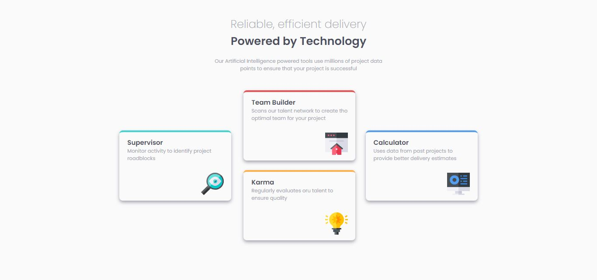

# Frontend Mentor - Solución del desafío Four card feature section

Esta es una solución para [Four card feature section challenge on Frontend Mentor](https://www.frontendmentor.io/challenges/four-card-feature-section-weK1eFYK).  Los desafíos de Frontend Mentor te ayudan a mejorar tus habilidades de codificación mediante la construcción de proyectos realistas.

## Tabla de contenidos

- [Resumen](#resumen)
  - [El desafío](#el-desafío)
  - [Captura de pantalla](#captura-de-pantalla)
  - [Enlaces](#enlaces)
- [Mi proceso](#mi-proceso)
  - [Construido con](#construido-con)
  - [Lo que aprendí](#lo-que-aprendí)
  - [Desarrollo continuo](#desarrollo-continuo)
  - [Recursos útiles](#recursos-útiles)
- [Autor](#autor)

## Resumen

### El desafío

Los usuarios deberían poder:

- Ver el diseño óptimo del sitio dependiendo del tamaño de pantalla de su dispositivo.

### Captura de pantalla

### Enlaces

- URL de la solución: [GitHub](https://github.com/ReyCrisGit/four-card-feature-section-master.git)
- URL del sitio en vivo: [GitHubPages](https://reycrisgit.github.io/four-card-feature-section-master/)

## Mi proceso

### Construido con

- Semantic HTML5 markup
- CSS custom properties
- Flexbox

### Lo que aprendí

Aprendí a usar position relative y absolute y flexbox.

### Desarrollo continuo

Tengo que aprender GRID porque, pienso que para este proyecto se debe hacer con GRID CSS.

### Recursos útiles

Los videos de [Jordan Alexander](https://www.youtube.com/@AlexCGDesign)

## Autor

Sitio web - [Cristian Barrios](https://github.com/ReyCrisGit)
Frontend Mentor - [Cristian Barrios](https://www.frontendmentor.io/profile/ReyCrisGit)
